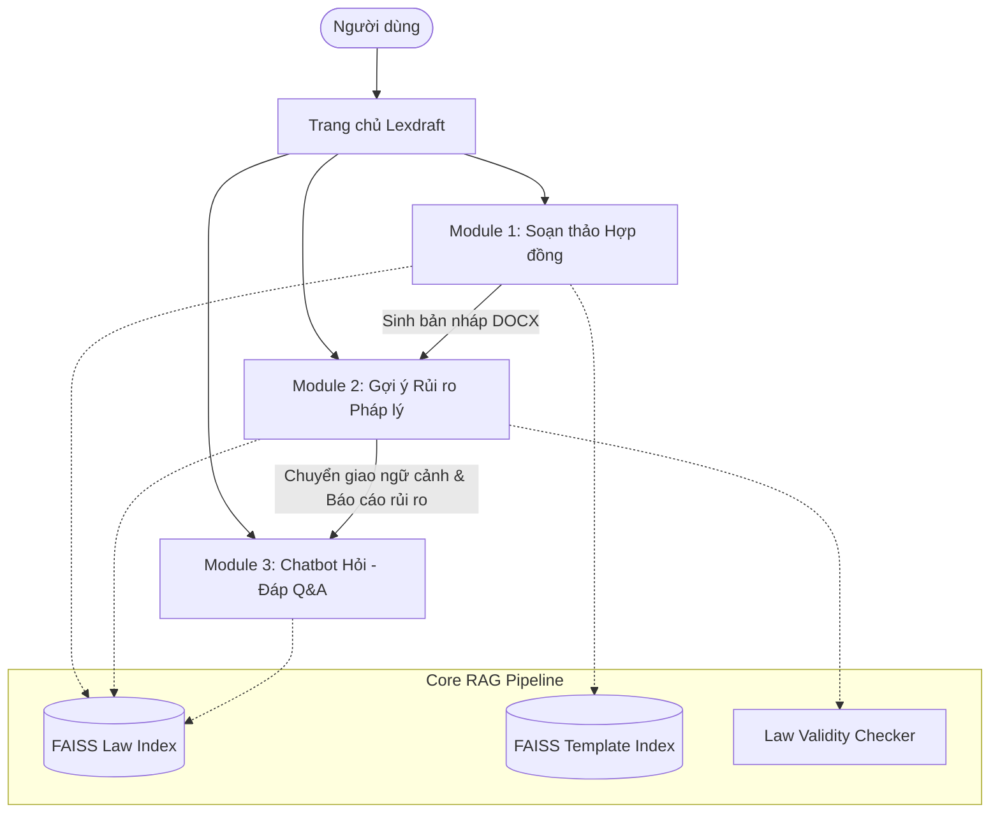

# Lexdraft — Legal Contract Drafting & Risk Assessment System ⚖️🤖

[](https://www.python.org/)
[](https://streamlit.io/)
[](https://ai.google.dev/)
[](https://ai.google.dev/)
[](https://github.com/facebookresearch/faiss)
[](https://arxiv.org/abs/2005.11401)
[](https://github.com/explodinggradients/ragas)

> **Lexdraft** là hệ thống ứng dụng Web hỗ trợ người dùng **soạn thảo**, **rà soát & gợi ý rủi ro pháp lý**, và **tra cứu hỏi - đáp** đối với hợp đồng dịch vụ theo quy định pháp luật Việt Nam. Hệ thống kết hợp mô hình ngôn ngữ lớn (**LLM**) với kỹ thuật **Retrieval-Augmented Generation (RAG)** và cơ chế **kiểm soát hiện tượng sinh ảo (hallucination)** nghiêm ngặt, đảm bảo mọi nhận định rủi ro đều bắt buộc đi kèm trích dẫn căn cứ Điều/Khoản luật có thật và còn hiệu lực thi hành.

---

## 📌 Mục lục

- [Giới thiệu Đề tài](#-giới-thiệu-đề-tài)
- [Tính năng Cốt lõi](#-tính-năng-cốt-lõi)
- [Cơ sở Tri thức Pháp luật](#-cơ-sở-tri-thức-pháp-luật)
- [Cơ chế Kiểm soát Sinh ảo (Hallucination Guardrails)](#-cơ-chế-kiểm-soát-sinh-ảo-hallucination-guardrails)
- [Kiến trúc Kỹ thuật & Tech Stack](#-kiến-trúc-kỹ-thuật--tech-stack)
- [Kết quả Thực nghiệm & Kiểm chứng Khoa học](#-kết-quả-thực-nghiệm--kiểm-chứng-khoa-học)
- [Cấu trúc Thư mục Dự án](#-cấu-trúc-thư-mục-dự-án)
- [Hướng dẫn Cài đặt & Khởi chạy (Local Setup)](#-hướng-dẫn-cài-đặt--khởi-chạy-local-setup)
- [Tuyên bố Miễn trừ Trách nhiệm (Legal Disclaimer)](#-tuyên-bố-miễn-trừ-trách-nhiệm-legal-disclaimer)
- [Thông tin Đề tài & Tác giả](#-thông-tin-đề-tài--tác-giả)

---

## 🎯 Giới thiệu Đề tài

Trong bối cảnh chuyển đổi số, các cá nhân, người làm việc tự do (*freelancer*), hộ kinh doanh và doanh nghiệp vừa và nhỏ (*SMEs*) thường sử dụng các mẫu hợp đồng trôi nổi trên Internet hoặc tự soạn thảo hợp đồng dịch vụ mà không có bộ phận pháp chế chuyên trách hỗ trợ. Điều này dẫn đến các rủi ro pháp lý nghiêm trọng như:
- Điều khoản thiếu sót, không rõ nghĩa hoặc mâu thuẫn.
- Thỏa thuận vi phạm điều cấm của luật (ví dụ: phạt vi phạm vượt mức trần luật định, miễn trừ trách nhiệm bồi thường trái luật, chuyển giao dữ liệu cá nhân sai quy định).
- Viện dẫn văn bản quy phạm pháp luật đã hết hiệu lực hoặc không tồn tại.

Tuy nhiên, việc sử dụng các mô hình AI tạo sinh thông thường tiềm ẩn nguy cơ **sinh ảo (hallucination)** — tự bịa đặt căn cứ pháp lý với văn phong tự tin. **Lexdraft** được nghiên cứu và phát triển để giải quyết triệt để vấn đề này bằng cách:
1. **Neo dữ liệu (Grounding) bằng RAG:** Mô hình chỉ được suy luận trên các đoạn luật thực tế được truy xuất từ kho tri thức chuẩn hóa.
2. **Quản lý phân cấp Điều/Khoản kèm Metadata nguồn:** Đảm bảo trích dẫn chính xác số hiệu văn bản, tên luật, Điều và Khoản.
3. **Cơ chế từ chối an toàn (Safe Refusal):** Chủ động cảnh báo hoặc từ chối khi câu hỏi nằm ngoài phạm vi tri thức, văn bản hết hiệu lực hoặc không tìm thấy đủ căn cứ pháp lý phù hợp.

---

## 🌟 Tính năng Cốt lõi

Hệ thống được thiết kế theo kiến trúc **Modular Monolith**, bao gồm 3 Module nghiệp vụ tích hợp chặt chẽ:



### 1. 📝 Module Soạn thảo Hợp đồng Dịch vụ (Drafting)
- **Nhập liệu qua biểu mẫu thông minh:** Tiếp nhận thông tin Bên A, Bên B, loại hợp đồng, số hiệu, giá trị, thời hạn hoàn thành, phạm vi công việc.
- **Tùy chọn tuân thủ pháp luật:** Tích hợp sẵn các tùy chọn tuân thủ chế định pháp luật mới nhất (bảo vệ dữ liệu cá nhân theo Luật BV dữ liệu cá nhân 2025, chuyển giao quyền SHTT theo Luật SHTT, mức phạt vi phạm giới hạn 8% theo Luật Thương mại, cơ quan giải quyết tranh chấp).
- **RAG hỗ trợ soạn thảo:** Truy xuất đồng thời cấu trúc mẫu hợp đồng chuẩn (`template_index`) và quy định pháp luật tương ứng (`law_index`).
- **Xem trước & Xuất file:** Cho phép xem trước văn bản trực tiếp theo định dạng trang in A4 và tải xuống file Microsoft Word (`.docx`) hoàn chỉnh.
- **Tích hợp liền mạch:** Tự động đẩy bản nháp vừa sinh sang Module Phân tích rủi ro chỉ với 1 click.

### 2. 🔍 Module Gợi ý Rủi ro Pháp lý (Risk Assessment - One-shot Pipeline)
- **Hỗ trợ đa định dạng tài liệu:** Cho phép tải lên tệp hợp đồng có sẵn định dạng PDF hoặc DOCX.
- **Phân đoạn có nhận thức cấu trúc (Structure-aware chunking):** Tự động bóc tách hợp đồng theo từng Điều/Khoản riêng biệt bằng biểu thức chính quy.
- **Kiểm tra tính hiệu lực văn bản (Law Validity Checker):** Quét các căn cứ pháp luật được viện dẫn trong hợp đồng; phát hiện và phát cảnh báo ngay lập tức nếu hợp đồng áp dụng văn bản luật đã hết hiệu lực hoặc văn bản giả mạo/không tồn tại trên thực tế.
- **Đối chiếu quy định pháp luật qua FAISS:** Truy xuất các quy định pháp luật điều chỉnh trực tiếp cho từng điều khoản cụ thể.
- **Phân loại rủi ro chuẩn xác:** Nhận diện các hành vi vi phạm điều cấm (phạt vi phạm vượt trần, miễn trừ trách nhiệm bất hợp pháp, chuyển nhượng bản quyền trái luật, v.v.) và xuất báo cáo rủi ro kèm căn cứ Điều/Khoản để người dùng đối chiếu.
- **Nguyên tắc không suy đoán:** Điều khoản tuân thủ quy định hoặc pháp luật không có quy định cấm sẽ được ghi nhận là không phát hiện rủi ro, không tự suy diễn thêm.

### 3. 💬 Module Chatbot Hỏi - Đáp Pháp lý (Conversational Legal Q&A)
- **Chế độ Có ngữ cảnh hợp đồng:** Tiếp nhận toàn bộ văn bản hợp đồng và bảng báo cáo rủi ro từ Module 2 để giải đáp chuyên sâu: giải thích chi tiết lý do vì sao một điều khoản bị cảnh báo, phân tích hậu quả pháp lý và định hướng giải pháp sửa đổi điều khoản.
- **Chế độ Không ngữ cảnh hợp đồng:** Hoạt động độc lập như một chuyên gia tra cứu quy định pháp luật về hợp đồng dịch vụ.
- **Neo dữ liệu & Từ chối an toàn:** Toàn bộ câu trả lời bắt buộc phải dựa trên các đoạn luật truy xuất được. Khi người dùng hỏi ngoài phạm vi hoặc gài bẫy văn bản luật giả mạo, chatbot kích hoạt phản hồi từ chối an toàn thay vì tự bịa câu trả lời.

---

## 📚 Cơ sở Tri thức Pháp luật

Cơ sở tri thức của hệ thống được thu thập từ Cổng thông tin điện tử Chính phủ và Cơ sở dữ liệu Quốc gia về Văn bản Pháp luật, tập trung vào chế định hợp đồng dịch vụ, sở hữu trí tuệ và bảo vệ dữ liệu số:

| STT | Văn bản Quy phạm Pháp luật | Số hiệu / Trạng thái | Vai trò chính |
| :---: | :--- | :--- | :--- |
| **1** | **Bộ luật Dân sự** | Luật số 91/2015/QH13 | Quy định chung về hợp đồng dịch vụ, bồi thường thiệt hại, đơn phương chấm dứt HĐ |
| **2** | **Luật Thương mại** | VBHN số 113/VBHN-VPQH năm 2025 | Chế định thương mại dịch vụ, mức trần phạt vi phạm 8% (Điều 301) |
| **3** | **Luật Sở hữu trí tuệ** | VBHN số 55/VBHN-VPQH năm 2026 | Quyền tác giả, quyền sở hữu bản quyền phần mềm, thiết kế số |
| **4** | **Luật Giao dịch điện tử** | Luật số 20/2023/QH15 | Giá trị pháp lý thông điệp dữ liệu, chữ ký điện tử trong ký kết HĐ |
| **5** | **Luật Bảo vệ dữ liệu cá nhân** | Luật số 91/2025/QH15 | Quy định thu thập, xử lý và chuyển giao dữ liệu cá nhân ra nước ngoài |
| **6** | **Luật Chuyển đổi số** | Năm 2025 (Luật số 129/2025/QH15) | Quy định dịch vụ công nghệ số, thay thế Luật CNTT 2006 |
| **7** | **Luật Trí tuệ nhân tạo** | Năm 2025 (Luật số 135/2025/QH15) | Quy định trách nhiệm và ứng dụng hệ thống AI trong dịch vụ |

Toàn bộ văn bản được phân đoạn thành **583 vector chunks** theo ranh giới Điều/Khoản, gán siêu dữ liệu đầy đủ (*Tên luật, số hiệu, Điều, Khoản, Điểm*) và quản lý tập trung trong chỉ mục `FAISS CPU`.

---

## 🛡️ Cơ chế Kiểm soát Sinh ảo (Hallucination Guardrails)

Dự án thiết lập cơ chế 4 tầng bảo vệ chống hiện tượng sinh ảo (hallucination) trong tư vấn pháp lý:

```
┌─────────────────────────────────────────────────────────────┐
│ TẦNG 1: Sàng lọc hiệu lực văn bản (Law Validity Checker)    │
│ -> Phát hiện ngay văn bản luật hết hiệu lực / luật giả mạo │
└──────────────────────────────┬──────────────────────────────┘
                               ▼
┌─────────────────────────────────────────────────────────────┐
│ TẦNG 2: Phân đoạn cấu trúc & Quản lý Siêu dữ liệu (Metadata)│
│ -> Chunking theo Điều/Khoản; ép LLM trích dẫn đúng nguồn   │
└──────────────────────────────┬──────────────────────────────┘
                               ▼
┌─────────────────────────────────────────────────────────────┐
│ TẦNG 3: Kiểm soát Ngưỡng tương đồng (Similarity Threshold)  │
│ -> Ngưỡng Cosine Similarity τ = 0.75; kích hoạt Safe Refusal│
└──────────────────────────────┬──────────────────────────────┘
                               ▼
┌─────────────────────────────────────────────────────────────┐
│ TẦNG 4: Thiết kế Prompt ràng buộc nghiêm ngặt (Grounding)   │
│ -> Bắt buộc chỉ suy luận trên context, thà từ chối còn hơn sai│
└─────────────────────────────────────────────────────────────┘
```

1. **Law Validity Checker (`data/expired_laws.json`):** Tra cứu từ điển trạng thái văn bản luật để chặn các trích dẫn luật cũ (ví dụ: Luật Giao dịch điện tử 2005, Luật CNTT 2006, Luật Bảo vệ quyền lợi NTD 2010) hoặc luật giả mạo (ví dụ: "Luật Thương mại 2020").
2. **Structure-Aware Chunking & Metadata Enrichment:** Không cắt nhỏ văn bản theo độ dài ký tự tùy tiện mà cắt theo ranh giới ngữ nghĩa Điều/Khoản. Mỗi chunk vector đi kèm metadata giúp mô hình luôn có thông tin nguồn xác thực để tạo trích dẫn.
3. **Cơ chế Ngưỡng & Từ chối an toàn (Safe Refusal):** Điểm Cosine Similarity giữa truy vấn và ngữ cảnh luật được kiểm soát chặt với ngưỡng $\tau = 0.75$. Nếu không có đoạn luật nào vượt qua ngưỡng, hệ thống lập tức kích hoạt phản hồi an toàn, tuyệt đối không cho phép LLM suy đoán.
4. **Prompt Grounding khắt khe:** Chỉ thị mô hình đóng vai trò trợ lý pháp lý khách quan, tách bạch giữa *rủi ro tiềm ẩn* và *kết luận vi phạm*, đồng thời không tự ý tạo thêm điều luật ngoài ngữ cảnh được cung cấp.

---

## 🏗️ Kiến trúc Kỹ thuật & Tech Stack

Hệ thống được tổ chức theo kiến trúc **Modular Monolith**, các module nghiệp vụ hoạt động độc lập và chia sẻ chung tầng hạ tầng kỹ thuật (`modules/shared/`):

| Thành phần | Công nghệ / Thư viện | Vai trò trong hệ thống |
| :--- | :--- | :--- |
| **Ngôn ngữ cốt lõi** | Python 3.10+ | Nền tảng thực thi toàn bộ pipeline backend, xử lý văn bản và thực nghiệm |
| **Giao diện Web** | Streamlit | Giao diện người dùng tương tác thời gian thực, quản lý phiên qua `st.session_state` |
| **Mô hình Ngôn ngữ (LLM)** | Google Gemini (`gemini-3.5-flash-lite`) | Tiếp nhận prompt kèm ngữ cảnh luật để sinh hợp đồng, phân tích rủi ro và trả lời Q&A |
| **Mô hình Nhúng (Embedding)**| Gemini Embedding (`models/gemini-embedding-2`) | Mã hóa ngữ nghĩa văn bản pháp luật và truy vấn thành vector 768 chiều |
| **Cơ sở dữ liệu Vector** | FAISS CPU (`faiss-cpu`) | Quản lý chỉ mục vector và thực hiện truy xuất gần đúng láng giềng (ANN) với Top-K = 10 |
| **Khung điều phối RAG** | LangChain / Google GenAI SDK | Kết nối API Gemini, quản lý chuỗi truy vấn và bộ chuyển đổi dữ liệu |
| **Xử lý tài liệu** | `python-docx`, `pdfplumber`, `pypdf` | Đọc và trích xuất hợp đồng PDF/DOCX, hỗ trợ xuất văn bản Word chuẩn hoá |
| **Framework Đánh giá** | Ragas (`ragas`) | Đánh giá định lượng tự động chất lượng RAG bằng kỹ thuật LLM-as-a-Judge |

---

## 📊 Kết quả Thực nghiệm & Kiểm chứng Khoa học

Chất lượng hệ thống Lexdraft đã được đánh giá định lượng thông qua ba bộ thực nghiệm khoa học, bộ 50 câu hỏi kiểm thử chuẩn và 5 hợp đồng đối sánh thực tế (chi tiết tại Chương 4 Báo cáo Thực tập tốt nghiệp):

### 1. Kiểm chứng Ba Giả thiết Khoa học

| Giả thiết Khoa học | Kịch bản Thực nghiệm | Kết quả Định lượng Đạt được | Mức độ Chấp nhận |
| :--- | :--- | :--- | :---: |
| **Giả thiết 1: RAG nâng cao độ tin cậy so với LLM thuần** | Thử nghiệm A/B đối chứng song song trên 50 câu hỏi (nhánh RAG vs nhánh LLM không RAG). | **Tỷ lệ ảo giác giảm từ 10.0% xuống 4.0%**. RAG chủ động từ chối trả lời an toàn khi gặp các câu hỏi bẫy về luật hết hiệu lực. | **Chấp nhận có điều kiện** |
| **Giả thiết 2: Cấu trúc Điều/Khoản & Metadata cải thiện trích dẫn** | Đo lường tầng truy xuất FAISS và nghiên cứu bóc tách (ablation study) trên 25 câu hỏi. | - **Hit@1 đạt 84.09%, Hit@3 đạt 93.18%**.<br>- Tỷ lệ trích dẫn đúng cấu trúc Điều/Khoản: **tăng từ 0.0% lên 100.0%**.<br>- Độ chính xác tên luật: **76.0% → 96.0%**; Điều luật: **76.0% → 92.0%**. | **Chấp nhận hoàn toàn** |
| **Giả thiết 3: Cơ chế ngưỡng kiểm soát triệt để ảo giác** | Ma trận kiểm thử 35 câu hỏi (20 câu hỏi bẫy luật hết hiệu lực/giả mạo + 15 câu hỏi hợp lệ). | - **Tỷ lệ từ chối an toàn đạt 100% (20/20 câu bẫy)**.<br>- **Tỷ lệ sinh ảo đạt 0.0% (0/35 câu)**.<br>- Tỷ lệ từ chối nhầm câu hỏi hợp lệ ở mức chấp nhận được: 6.67%. | **Chấp nhận với độ tin cậy cao** |

### 2. Đánh giá Chất lượng RAG bằng Framework Ragas (LLM Judge)

Sử dụng `gemini-3.5-flash-lite` làm giám khảo độc lập chấm điểm trên thang $[0.0, 1.0]$:

| Nhóm Kiểm thử | Số lượng | Context Precision | Context Recall | Faithfulness | Nhận xét Chuyên môn |
| :--- | :---: | :---: | :---: | :---: | :--- |
| **Fact Retrieval** *(Tra cứu luật hiện hành)* | 44 mẫu | **0.88** | **1.00 (100%)** | **0.85 - 0.95** | Truy xuất chính xác 100% các điều luật cốt lõi; nội dung câu trả lời bám sát văn bản luật. |
| **Negative Test** *(Luật hết hiệu lực / Giả mạo)* | 6 mẫu | **0.75** | *Cơ chế lọc* | *Từ chối an toàn* | Nhận diện đúng và kích hoạt câu trả lời từ chối an toàn theo kịch bản chống ảo giác. |
| **Toàn bộ Bộ dữ liệu** | 50 mẫu | **0.79** | **0.57** | **0.28\*** | Thể hiện sự cân bằng giữa năng lực truy xuất và cơ chế phòng vệ chống ảo giác. |

> [!NOTE]
> *\*Chỉ số Faithfulness tính chung trên 50 mẫu (0.28) xuất phát từ thuật toán của Ragas tự động gán điểm 0.0 cho các câu trả lời từ chối an toàn (do không chứa thông tin trong luật), hoàn toàn không phải do hệ thống sinh thông tin sai lệch.*

### 3. Hiệu năng Phát hiện Rủi ro trên Bộ 5 Hợp đồng Đối sánh

Thực nghiệm trên 5 hợp đồng dịch vụ hoàn chỉnh (gồm 43 điều khoản, trong đó 2 hợp đồng chuẩn sạch và 3 hợp đồng cài cắm 13 lỗi vi phạm có chủ đích):

- **Số lỗi phát hiện đúng (True Positive):** **12 / 13 lỗi** (Độ nhạy **Recall = 92.3%**).
- **Số lỗi bỏ sót (False Negative):** **1 lỗi** (Thỏa thuận phạt vi phạm 15% — do LLM diễn giải theo hướng tự do thỏa thuận dân sự).
- **Cảnh báo tư vấn (False Positive):** 5 điều khoản (Đều là các góp ý khuyến nghị tăng cường bảo vệ quyền lợi, không gây sai lệch pháp lý).
- **Thời gian phân tích trung bình:** ~32 - 71 giây cho một hợp đồng hoàn chỉnh.

---

## 📂 Cấu trúc Thư mục Dự án

```text
Lexdraft/
├── data/                                 # Quản lý dữ liệu pháp luật và vector DB
│   ├── expired_laws.json                 # Từ điển trạng thái văn bản luật hết hiệu lực / giả mạo
│   ├── faiss_index/                      # Chỉ mục FAISS lưu trữ vector
│   │   ├── law_index/                    # Chỉ mục tri thức pháp luật (583 chunks)
│   │   ├── template_index/               # Chỉ mục mẫu hợp đồng tham chiếu
│   │   └── contract_index/               # Vùng lưu trữ vector hợp đồng phiên làm việc
│   ├── raw/                              # Dữ liệu gốc trước khi tiền xử lý
│   │   ├── law/                          # Văn bản quy phạm pháp luật (.md, .docx)
│   │   └── templates/                    # Các mẫu hợp đồng dịch vụ tiêu chuẩn
│   └── test_contract_*.docx              # Các tệp hợp đồng kiểm thử rủi ro thực nghiệm
│
├── modules/                              # Kiến trúc Modular Monolith Backend
│   ├── drafting/                         # Module 1: Hỗ trợ soạn thảo hợp đồng
│   │   ├── generator.py                  # Pipeline sinh nội dung hợp đồng bằng LLM + RAG
│   │   ├── retrieval.py                  # Truy xuất template và điều luật tương ứng
│   │   └── service.py                    # API Service đóng gói cho Module 1
│   ├── risk_assessment/                  # Module 2: Gợi ý rủi ro pháp lý hợp đồng
│   │   ├── law_validity_checker.py       # Bộ quét phát hiện văn bản luật hết hiệu lực
│   │   ├── prompts.py                    # Mẫu prompt chuyên biệt phân tích điều khoản
│   │   ├── retrieval.py                  # Truy xuất căn cứ pháp luật theo điều khoản
│   │   └── service.py                    # One-shot pipeline phân tích toàn bộ hợp đồng
│   ├── chatbot_qa/                       # Module 3: Chatbot hỏi - đáp pháp luật
│   │   ├── prompts.py                    # Prompt RAG cho 2 chế độ (có/không ngữ cảnh)
│   │   ├── retrieval.py                  # Truy xuất tri thức & kiểm soát ngưỡng an toàn
│   │   └── service.py                    # Quản trị hội thoại và phiên làm việc
│   └── shared/                           # Tầng hạ tầng dùng chung (Shared Infrastructure)
│       ├── chunking.py                   # Structure-aware chunking Điều/Khoản
│       ├── document_reader.py            # Trích xuất văn bản từ PDF và DOCX
│       ├── embedding.py                  # Wrapper Gemini Embedding 768 chiều
│       ├── llm_client.py                 # Wrapper Google GenAI Client
│       └── logger.py                     # Tiện ích ghi log hệ thống
│
├── ui/                                   # Tầng giao diện người dùng (Streamlit Frontend)
│   ├── pages/
│   │   ├── page_home.py                  # Trang chủ điều hướng và giới thiệu
│   │   ├── page_drafting.py              # Giao diện soạn thảo, form nhập & preview A4
│   │   ├── page_risk.py                  # Giao diện tải file, quét hiệu lực & bảng rủi ro
│   │   └── page_chatbot.py               # Giao diện hội thoại hỏi - đáp pháp luật
│   └── styles.py                         # Custom CSS giao diện hiện đại, chuyên nghiệp
│
├── evaluation/                           # Bộ công cụ đánh giá & kiểm chứng khoa học
│   ├── testset.csv                       # Bộ dữ liệu 50 cặp câu hỏi - đáp án chuẩn
│   ├── test_h1_ab_comparison.py          # Script kiểm chứng Giả thiết 1 (A/B Testing)
│   ├── test_h2_metadata_ablation.py      # Script kiểm chứng Giả thiết 2 (Ablation Study)
│   ├── test_h3_hallucination_refusal.py  # Script kiểm chứng Giả thiết 3 (Safe Refusal)
│   └── run_ragas_eval.py                 # Đánh giá tự động RAG bằng framework Ragas
│
├── scripts/                              # Kịch bản bảo trì và vận hành hệ thống
│   ├── build_index.py                    # Script xây dựng lại toàn bộ FAISS Index
│   ├── prune_laws.py                     # Làm sạch và tối ưu dữ liệu luật thô
│   └── run_all_hypothesis_tests.py       # Chạy tự động cả 3 bài kiểm chứng giả thiết
│
├── Docs/                                 # Tài liệu kỹ thuật và Báo cáo đề tài
│   └── .md/TTTN_Nhóm14.md               # Toàn văn Báo cáo Thực tập tốt nghiệp Nhóm 14
├── app.py                                # Điểm khởi chạy chính của ứng dụng Streamlit
├── config.py                             # Cấu hình tập trung (đường dẫn, model, thresholds)
├── requirements.txt                      # Danh mục thư viện phụ thuộc chính
├── requirements-dev.txt                  # Thư viện phục vụ kiểm thử và phát triển
└── CONTRIBUTING.md                       # Quy chuẩn đóng góp mã nguồn & Git workflow
```

---

## 🚀 Hướng dẫn Cài đặt & Khởi chạy (Local Setup)

### 1. Yêu cầu Hệ thống
- **Hệ điều hành:** Windows 10/11, macOS hoặc Linux.
- **Python:** Phiên bản `3.10` trở lên (Khuyến nghị `3.10` – `3.12`).
- **Git** đã cài đặt trên máy.

### 2. Tải mã nguồn & Tạo môi trường ảo
```bash
# Clone kho lưu trữ về máy
git clone https://github.com/gthinh29/Lexdraft.git
cd Lexdraft

# Khởi tạo môi trường ảo (Virtual Environment)
# Trên Windows:
python -m venv venv
.\venv\Scripts\activate

# Trên Linux / macOS:
python3 -m venv venv
source venv/bin/activate
```

### 3. Cài đặt Thư viện Phụ thuộc
```bash
# Cài đặt thư viện vận hành ứng dụng
pip install -r requirements.txt

# Cài đặt thêm thư viện phát triển và kiểm thử (tùy chọn)
pip install -r requirements-dev.txt
```

### 4. Cấu hình Khóa API (Google Gemini)
Tạo file `.env` tại thư mục gốc của dự án (ngang hàng với `config.py`) và điền API Key của Google Gemini:
```env
GEMINI_API_KEY="AIzaSyYourGeminiApiKeyHere"
```
*(Bạn có thể lấy khóa API miễn phí hoặc trả phí tại [Google AI Studio](https://aistudio.google.com/)).*

### 5. Xây dựng Chỉ mục Dữ liệu (Khởi tạo lần đầu)
Nếu thư mục `data/faiss_index/` chưa có sẵn hoặc bạn có sự thay đổi trong dữ liệu luật thô `data/raw/`, hãy chạy lệnh sau để lập chỉ mục vector:
```bash
python scripts/build_index.py
```

### 6. Khởi chạy Ứng dụng Web
Khởi động giao diện Streamlit bằng lệnh:
```bash
streamlit run app.py
```
Sau khi khởi chạy thành công, trình duyệt sẽ tự động mở tại địa chỉ: `http://localhost:8501`.

### 7. Chạy Đánh giá & Kiểm chứng Thực nghiệm (Tùy chọn)
```bash
# Chạy đánh giá RAG bằng framework Ragas
python evaluation/run_ragas_eval.py

# Chạy toàn bộ 3 bài kiểm chứng giả thiết khoa học
python scripts/run_all_hypothesis_tests.py
```

---

## ⚖️ Tuyên bố Miễn trừ Trách nhiệm (Legal Disclaimer)

> [!CAUTION]
> **Hệ thống Lexdraft được xây dựng nhằm mục đích nghiên cứu học thuật và hỗ trợ thông tin tham khảo.**
> 
> Các kết quả phân tích rủi ro, dự thảo hợp đồng hoặc giải đáp từ Chatbot **không có giá trị thay thế ý kiến tư vấn pháp lý chuyên nghiệp từ luật sư hoặc các chuyên gia pháp chế có thẩm quyền**. Người sử dụng có trách nhiệm tự kiểm tra, đối chiếu văn bản hợp đồng với các điều luật được trích dẫn trước khi ký kết hoặc áp dụng vào thực tế thương mại.

---

## 👥 Thông tin Đề tài & Tác giả

Đề tài được thực hiện trong khuôn khổ **Báo cáo Thực tập Tốt nghiệp** — Viện Công nghệ Thông tin và Điện, Điện tử — Trường **Đại học Giao thông Vận tải TP.HCM (UTH)**.

- **Tên đề tài:** Xây dựng hệ thống hỗ trợ soạn thảo và gợi ý rủi ro hợp đồng dịch vụ bằng mô hình ngôn ngữ lớn (LLM) kết hợp Retrieval-Augmented Generation (RAG).
- **Giảng viên hướng dẫn:** **TS. Hàn Trung Định**
- **Nhóm sinh viên thực hiện (Nhóm 14):**
  1. **Phạm Gia Thịnh**
  2. **Lê Hữu Tiến**
- **Niên khóa:** 2023 – 2027
