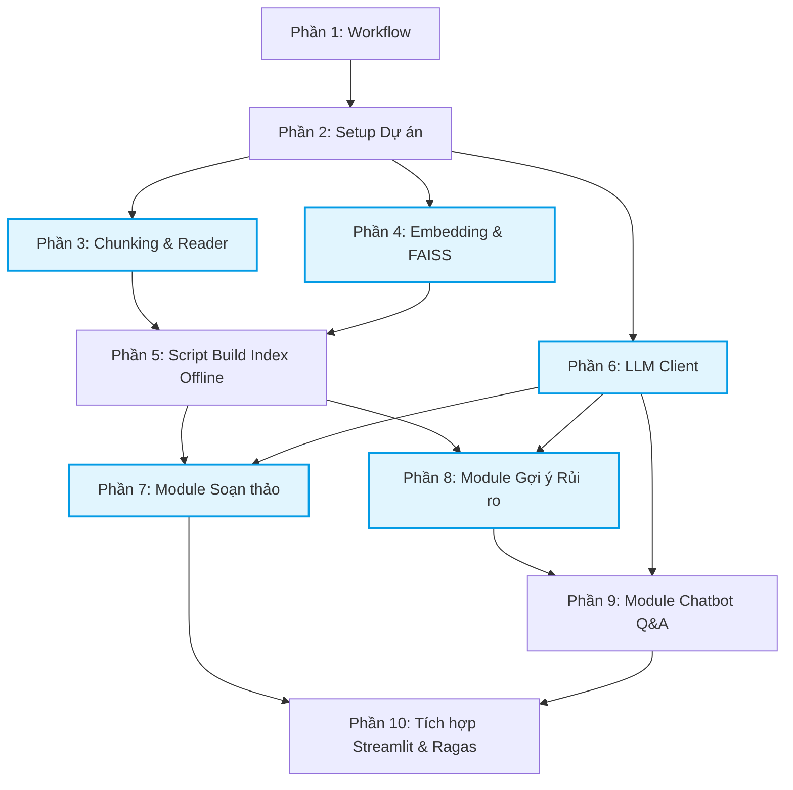

# KẾ HOẠCH THỰC THI DỰ ÁN & TODO LIST
**Mục đích:** Cung cấp lộ trình 10 phần cực kỳ chi tiết từ 0 - 100% dựa trên tài liệu `SRS_He_Thong.md`.
**Đối tượng:** 2 Lập trình viên (Dev A và Dev B).

---

## SƠ ĐỒ TIẾN TRÌNH & PHÂN CÔNG (ROADMAP & DEPENDENCIES)

Sơ đồ dưới đây thể hiện sự phụ thuộc giữa các Task. Mũi tên chỉ ra Task nào phải làm xong trước thì Task sau mới được bắt đầu. Những Task nằm ngang hàng hoặc không có mũi tên ràng buộc nhau là các **Task Độc Lập**, 2 bạn có thể chia nhau làm cùng lúc.

**Gợi ý Phân công Song song (Tối ưu cho 2 người):**
- **Giai đoạn 1 (Lõi dữ liệu):** Dev A làm **Phần 3** (Chunking). Dev B làm **Phần 4** (Embedding).
- **Giai đoạn 2 (Chuẩn bị AI):** Dev A làm **Phần 5** (Gom code phần 3 & 4 để build index). Dev B làm **Phần 6** (Setup API LLM & khiên chống Hallucination).
- **Giai đoạn 3 (Nghiệp vụ - Có thể làm cùng lúc):** Dev A làm **Phần 7** (Soạn thảo). Dev B làm **Phần 8** (Gợi ý rủi ro).
- **Giai đoạn 4 (Hoàn thiện):** Dev A làm **Phần 9** (Chatbot). Dev B thiết kế khung **Phần 10** (Streamlit Frontend). Cuối cùng cả 2 ráp lại.

---

## HƯỚNG DẪN SỬ DỤNG TODO LIST NÀY CÙNG AI

> [!IMPORTANT]
> **LUẬT BẮT BUỘC TRƯỚC KHI CODE:** Mọi thành viên phải đọc và hiểu rõ file [CONTRIBUTING.md](../CONTRIBUTING.md) (Developer Guide) để nắm chuẩn mực git, ranh giới kiến trúc và setup logger. Không code hay dùng AI nếu chưa đọc file này!

Khi nhận một task, **KHÔNG** quăng toàn bộ file cho AI. Hãy làm theo bước sau:
1. Tạo một file tạm tên là `task_dang_lam.md`.
2. Copy nguyên văn chi tiết của Phần Todo bạn chọn (VD: Phần 3) vào file đó.
3. Sử dụng Prompt sau:
   > *"Hãy đóng vai trò là một Senior Software Engineer. Đọc tài liệu kiến trúc tại `SRS/SRS_He_Thong.md` và yêu cầu công việc cụ thể tại `task_dang_lam.md`. Nhiệm vụ của bạn là triển khai đoạn code cho task này. Hãy tuân thủ nghiêm ngặt ranh giới module (Modular Monolith) và cơ chế chống Hallucination. Vui lòng giải thích hướng đi trước, sau đó mới viết code chi tiết."*
4. Tuân thủ tạo Branch (`feat/...`, `fix/...`) và Conventional Commits (`feat: ...`, `fix: ...`) trước khi merge vào `main`.

---

## CHI TIẾT CÁC PHẦN (TODO SUB-TASKS)

### PHẦN 1 & 2: KHỞI TẠO DỰ ÁN VÀ QUY TRÌNH (Làm chung)
- [ ] **1.1.** (BẮT BUỘC) Cả 2 thành viên đọc kỹ `CONTRIBUTING.md`, `SRS_He_Thong.md` và file Todo này. Thống nhất và tuân thủ nghiêm ngặt quy tắc Branch, Commit, Logging trong `CONTRIBUTING.md`.
- [ ] **2.1.** Khởi tạo repo Git, tạo `.gitignore` loại trừ `venv/`, `.env`, `__pycache__/`, `*.faiss`, `*.pkl`.
- [ ] **2.2.** Khởi tạo `venv` và file `requirements.txt` (thêm `streamlit, langchain, faiss-cpu, pdfplumber, python-docx, google-generativeai, ragas, python-dotenv`).
- [ ] **2.3.** Tạo cấu trúc thư mục chuẩn: `data/raw/`, `data/faiss_index/`, `modules/drafting/`, `modules/risk_assessment/`, `modules/chatbot_qa/`, `modules/shared/`, `scripts/`, `evaluation/`.
- [ ] **2.4.** Tạo file `config.py` để dùng `os.getenv()` nạp key Gemini và lưu đường dẫn cố định.

---

### PHẦN 3: MODULE ĐỌC & CHUNKING (DEV A)
**Vị trí:** `modules/shared/document_reader.py` và `modules/shared/chunking.py`
- [ ] **3.1.** Viết hàm `read_pdf(file_path)` dùng `pdfplumber` (bỏ qua ảnh scan).
- [ ] **3.2.** Viết hàm `read_docx(file_path)` dùng `python-docx`.
- [ ] **3.3.** Viết hàm `read_document(file_path)` làm controller bọc 2 hàm trên dựa vào đuôi file.
- [ ] **3.4.** Trong `chunking.py`, viết hàm `chunk_by_article(text, source_metadata)`.
- [ ] **3.5.** Áp dụng Regex mở rộng để chia text, bao quát các trường hợp viết hoa/viết thường và dấu câu (vd: `Điều 1.`, `Điều 1:`, `ĐIỀU 1`).
- [ ] **3.6.** Format output của hàm chunking thành mảng các dict: `[{"content": "...", "metadata": {"article": "Điều 1", "source": "Luật DS"}}]`. Cài đặt **Cơ chế Fallback**: nếu đoạn không chứa chữ Điều, gán `{"article": "Quy định chung"}`.
- [ ] **3.7.** Thực hiện **Test mù (Blind Test)**: Chạy thử hàm Regex và `print()` toàn bộ kết quả ra Terminal để kiểm tra bằng mắt thường việc cắt Điều và gán Metadata trước khi kích hoạt gọi API Embedding.

---

### PHẦN 4: EMBEDDING & FAISS METADATA FILTERING (DEV B)
**Vị trí:** `modules/shared/embedding.py`
- [ ] **4.1.** Viết class `VectorDB`. Trong hàm `__init__`, cấu hình **Gemini API** (`text-embedding-004`) để làm embedding model.
- [ ] **4.2.** Viết hàm `create_index(chunks)`: lấy list text từ chunks, mã hóa thành vector và nạp vào FAISS cùng với metadata (số Điều/Khoản).
- [ ] **4.3.** Viết hàm `save_index(path)`: lưu file `.faiss` cho vector và file `.pkl` để giữ Metadata của chunks (cực kỳ quan trọng để truy xuất ngược).
- [ ] **4.4.** Viết hàm `load_index(path)`: Load lại `.faiss` và `.pkl`.
- [ ] **4.5.** Viết hàm `search_with_metadata(query, metadata_filter, top_k=5)`: Thực hiện tìm kiếm semantic với FAISS, kết hợp **lọc siêu dữ liệu (Metadata Filtering)** theo số Điều/Khoản, trả về top K chunk (chứa cả text và metadata).

---

### PHẦN 5: SCRIPT BUILD INDEX OFFLINE (DEV A)
**Vị trí:** `scripts/build_index.py` (Script chạy độc lập 1 lần)
- [ ] **5.1.** Viết script đọc toàn bộ file luật trong `data/raw/law/`.
- [ ] **5.2.** Gọi `read_document()` và `chunk_by_article()` (Phần 3) cho từng file.
- [ ] **5.3.** Áp dụng chiến thuật **Chia lô và Ngủ (Batching & Sleeping)** để xử lý lỗi Rate Limit (429) của Gemini API: cắt mảng chunks tổng thành các lô nhỏ (vd: 10 chunk/lần), dùng `time.sleep(5)` giữa các lô, hoặc dùng `max_retries` của LangChain.
- [ ] **5.4.** Đưa tuần tự các lô vào `create_index()` và gọi `save_index()` (Phần 4) để lưu ra `data/faiss_index/law_index`.
- [ ] **5.5.** Làm tương tự cho thư mục `data/raw/templates/` -> lưu ra `template_index`.

---

### PHẦN 6: LLM CLIENT & CHỐNG HALLUCINATION (DEV B)
**Vị trí:** `modules/shared/llm_client.py`
- [ ] **6.1.** Cấu hình Gemini API (`google.generativeai`). Set `thinking_budget=0` để tắt suy luận ẩn.
- [ ] **6.2.** Viết hàm `generate_grounded_response(query, retrieved_chunks, threshold=0.7)`.
- [ ] **6.3.** Code logic Threshold: Lặp qua `retrieved_chunks`, nếu score cao nhất < 0.7, lập tức `return {"answer": "Không tìm thấy căn cứ pháp lý phù hợp.", "citations": []}`.
- [ ] **6.4.** Code prompt Grounded Generation: Ghép nội dung chunks vào khối `CĂN CỨ:` trong prompt. Ràng buộc LLM chỉ trả lời bằng căn cứ này.
- [ ] **6.5.** Trích xuất metadata từ `retrieved_chunks` để tạo danh sách `citations` trả về kèm câu trả lời.

---

### PHẦN 7: MODULE SOẠN THẢO HỢP ĐỒNG (DEV A)
**Vị trí:** `modules/drafting/`
- [ ] **7.1.** Tạo `retrieval.py`: Viết hàm lấy mẫu từ `template_index` và luật từ `law_index`.
- [ ] **7.2.** Tạo `prompts.py`: Viết prompt template nhận 3 biến `{template}`, `{law_context}`, `{user_input}` để yêu cầu sinh hợp đồng.
- [ ] **7.3.** Tạo `service.py`: Viết hàm `generate_contract_draft(user_input_dict)`. Gọi chuỗi `retrieval` -> `prompt` -> `llm_client` (Phần 6).
- [ ] **7.4.** Tích hợp tự động: Cuối hàm `generate_contract_draft`, gọi sang `risk_assessment/service.py` để lấy report rủi ro cho bản nháp vừa sinh. Return cả 2.

---

### PHẦN 8: MODULE GỢI Ý RỦI RO (ONE-SHOT PIPELINE) (DEV B)
**Vị trí:** `modules/risk_assessment/`
- [ ] **8.1.** Tạo `service.py`: Viết hàm `analyze_contract(file_path_or_text, session_id)`.
- [ ] **8.2.** Trong hàm trên, gọi `chunk_by_article()` để chia hợp đồng đầu vào thành list Điều Khoản. Lưu tạm các Điều Khoản này vào `contract_index` (sống trong RAM hoặc disk tạm).
- [ ] **8.3.** Tạo `retrieval.py`: Viết hàm tìm luật từ `law_index` cho 1 Điều khoản.
- [ ] **8.4.** Viết vòng lặp trong `service.py`: Duyệt qua TỪNG Điều khoản, gọi `retrieval.py` tìm luật. Sau đó gọi `llm_client` để đánh giá rủi ro.
- [ ] **8.5.** Gom kết quả thành mảng JSON `[{"dieu_khoan": "...", "rui_ro": "...", "can_cu": [...]}]` và trả về.

---

### PHẦN 9: MODULE CHATBOT Q&A (DEV A)
**Vị trí:** `modules/chatbot_qa/`
- [ ] **9.1.** Tạo `chat_session.py`: Class quản lý tin nhắn (lưu role user/model và text). Viết hàm `get_text_history()` chỉ lấy text ngắn gọn, bỏ qua context RAG cũ.
- [ ] **9.2.** Tạo `retrieval.py`: Hàm `search_context(query, has_session=False)` - nếu True thì search cả `contract_index` + `law_index`, nếu False chỉ search `law_index`.
- [ ] **9.3.** Tạo `prompts.py`: Prompt linh hoạt cho Chế độ A (Có ngữ cảnh hợp đồng & bảng rủi ro) và Chế độ B (Chỉ tra cứu luật).
- [ ] **9.4.** Tạo `service.py`: Hàm `handle_chat(message, session_id, risk_report_context)`. Trả về `{answer, citations}` và update object session.

---

### PHẦN 10: STREAMLIT FRONTEND & ĐÁNH GIÁ (DEV A + B)
**Vị trí:** `app.py` và `evaluation/run_ragas_eval.py`
- [ ] **10.1 (Frontend).** Setup `app.py` với `st.sidebar` để tạo 3 tab: (1) Soạn thảo, (2) Upload Hợp đồng, (3) Chatbot.
- [ ] **10.2 (Frontend).** Dùng `st.session_state` để nạp 1 lần các FAISS index nặng (`@st.cache_resource`) khi app khởi động.
- [ ] **10.3 (Frontend).** Code UI cho Tab Soạn thảo: Các trường input `st.text_input`, nút Submit gọi `drafting.service`. Hiện kết quả + nút Download DOCX.
- [ ] **10.4 (Frontend).** Code UI cho Tab Upload: Dùng `st.file_uploader`, gọi `risk_assessment.service`. Hiện bảng rủi ro dạng Card/Expander.
- [ ] **10.5 (Frontend).** Code UI cho Tab Chatbot: Dùng `st.chat_message`, liên kết `st.session_state` để giữ lịch sử, gọi `chatbot_qa.service`.
- [ ] **10.6 (Đánh giá).** Viết script `run_ragas_eval.py`, đọc `testset.csv`, chạy qua Module 3 Chế độ B, đưa vào `ragas` tính 4 chỉ số (Precision, Recall, Faithfulness, Relevancy) và in kết quả.
