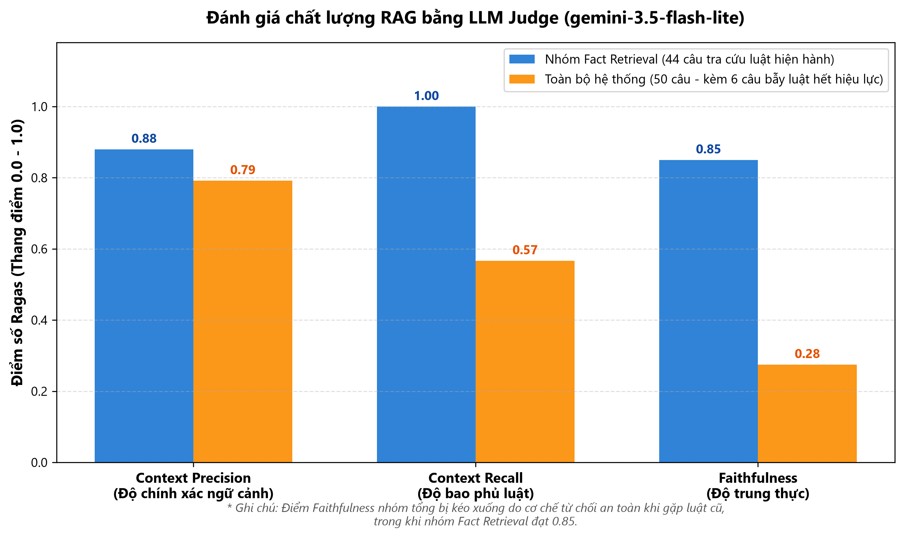
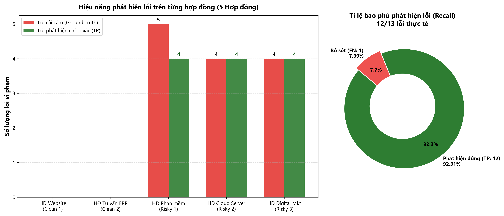
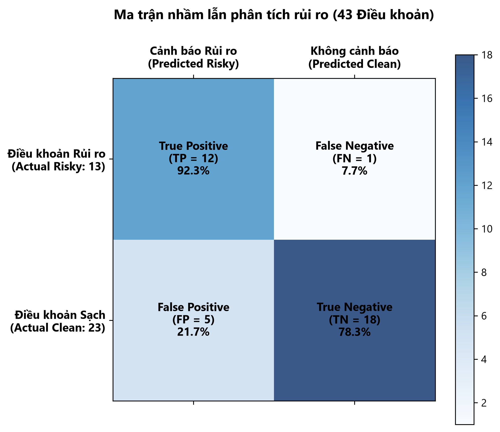

# CHƯƠNG 4. KẾT QUẢ THỰC NGHIỆM VÀ ĐÁNH GIÁ HỆ THỐNG

Dựa trên các tiêu chí và phương pháp đánh giá đã đề xuất tại Chương 3, chương này trình bày quá trình thực nghiệm và kết quả đánh giá hệ thống Lexdraft. Quá trình đánh giá được tiến hành độc lập trên hai phương diện:

* Đánh giá chất lượng của pipeline Retrieval-Augmented Generation (RAG) thông qua framework Ragas và mô hình LLM Judge độc lập.
* Đánh giá khả năng phát hiện rủi ro và điều khoản vi phạm pháp luật trên bộ 5 hợp đồng dịch vụ kiểm thử thực tế (gồm cả hợp đồng chuẩn sạch và hợp đồng được cài cắm lỗi vi phạm).

## 4.1. Môi trường và dữ liệu thực nghiệm

### 4.1.1. Cấu hình môi trường thực nghiệm

Toàn bộ quá trình kiểm thử và đánh giá hệ thống được thực hiện trên môi trường phần cứng và phần mềm như sau:

* **Phần cứng:** Máy tính cá nhân trang bị bộ vi xử lý x86_64 đa nhân, bộ nhớ trong (RAM) 16 GB.
* **Hệ điều hành:** Microsoft Windows 11 (64-bit).
* **Môi trường thực thi:** Python phiên bản 3.14.
* **Cơ sở dữ liệu vector:** Thư viện FAISS (Facebook AI Similarity Search) kết hợp mô hình embedding `models/gemini-embedding-2` tạo vector đặc trưng 768 chiều.
* **Mô hình ngôn ngữ lớn (LLM):** Google Gemini (`gemini-3.5-flash-lite`), tương tác thông qua Google GenAI SDK.
* **Công cụ đánh giá RAG:** Framework Ragas phiên bản 0.4.3, tích hợp bộ điều khiển tùy biến `GeminiRagasLLM` để chấm điểm tự động.
* **Công cụ trực quan hóa dữ liệu:** Thư viện Matplotlib cấu hình phông chữ hỗ trợ Unicode tiếng Việt.

### 4.1.2. Xây dựng và thẩm định bộ dữ liệu kiểm thử (Golden Dataset)

Để phục vụ công tác đánh giá định lượng pipeline RAG theo phương pháp nêu tại Mục 3.5, nhóm đã xây dựng một bộ dữ liệu kiểm thử chuẩn (*Golden Dataset*) gồm **50 mẫu câu hỏi và câu trả lời tham chiếu**.

Toàn bộ các mẫu trong tập dữ liệu đều được nhóm biên soạn trực tiếp từ các văn bản quy phạm pháp luật đang có hiệu lực trong cơ sở tri thức của hệ thống và danh mục các văn bản pháp luật hết hiệu lực đã được thống kê.

Bộ dữ liệu được phân chia thành hai nhóm chính:

* **Nhóm 1 - Tra cứu quy định pháp luật (Fact Retrieval):** Gồm 44 mẫu (chiếm 88% tập dữ liệu), tập trung vào các quy định cụ thể của pháp luật điều chỉnh hợp đồng dịch vụ:
  * *Bộ luật Dân sự năm 2015 (18 mẫu):* Khảo sát các quy định về định nghĩa và đối tượng của hợp đồng dịch vụ (Điều 513, Điều 514); quyền và nghĩa vụ của các bên (Điều 515, Điều 516, Điều 517); tiền dịch vụ (Điều 519); quyền đơn phương chấm dứt hợp đồng và nghĩa vụ thông báo trước (Điều 520, Điều 428); bồi thường thiệt hại và thỏa thuận phạt vi phạm (Điều 351, Điều 360, Điều 418).
  * *Luật Thương mại năm 2005 (14 mẫu):* Khảo sát hình thức hợp đồng dịch vụ (Điều 74); nghĩa vụ cung ứng dịch vụ theo kết quả (Điều 79); các trường hợp miễn trách nhiệm do bất khả kháng (Điều 294); giới hạn mức phạt vi phạm hợp đồng tối đa 8% giá trị phần nghĩa vụ bị vi phạm (Điều 301); thời hiệu khiếu nại và khởi kiện tranh chấp (Điều 318, Điều 319).
  * *Luật Sở hữu trí tuệ (sửa đổi năm 2022) (4 mẫu):* Khảo sát quyền tác giả đối với chương trình máy tính và website (Điều 22); thỏa thuận chủ sở hữu quyền tác giả khi ký kết hợp đồng dịch vụ sáng tạo (Điều 39).
  * *Luật Giao dịch điện tử năm 2023 (4 mẫu):* Khảo sát giá trị pháp lý của hợp đồng điện tử và việc gửi nhận chứng từ dữ liệu (Điều 34, Điều 35, Điều 36).
  * *Luật Bảo vệ dữ liệu cá nhân năm 2025 & Nghị định 13/2023/NĐ-CP (4 mẫu):* Khảo sát nguyên tắc thu thập và xử lý dữ liệu cá nhân (Điều 9); điều kiện chuyển dữ liệu cá nhân ra nước ngoài (Điều 30).

* **Nhóm 2 - Kiểm thử phát hiện văn bản hết hiệu lực và giả mạo (Negative Test):** Gồm 6 mẫu (chiếm 12% tập dữ liệu), đóng vai trò kiểm tra khả năng nhận diện và từ chối cung cấp căn cứ sai lệch:
  * Viện dẫn Luật Giao dịch điện tử năm 2005 (đã hết hiệu lực từ ngày 01/07/2024).
  * Viện dẫn Luật Công nghệ thông tin năm 2006 (hết hiệu lực từ ngày 01/07/2026 theo Luật Chuyển đổi số năm 2025).
  * Viện dẫn Luật Bảo vệ quyền lợi người tiêu dùng năm 2010 (đã hết hiệu lực từ ngày 01/07/2024).
  * Viện dẫn Bộ luật Dân sự năm 2005 (đã hết hiệu lực từ ngày 01/01/2017).
  * Viện dẫn Luật Thương mại năm 1997 (đã hết hiệu lực từ ngày 01/01/2006).
  * Viện dẫn văn bản giả mạo mang tên *"Luật Thương mại 2020"* (không có thực trong hệ thống văn bản quy phạm pháp luật Việt Nam).

Tập dữ liệu được lưu trữ tại `data/eval/golden_dataset.json` và đồng bộ dưới định dạng `evaluation/testset.csv`. Quá trình kiểm định chất lượng bằng hàm tự động xác nhận:

* 100% mẫu câu hỏi có mã định danh phân biệt, không xảy ra trùng lặp.
* Độ dài trung bình của câu hỏi đạt 16.4 từ; độ dài trung bình của câu trả lời tham chiếu đạt 42.8 từ.
* 100% mẫu thuộc nhóm Fact Retrieval đều gắn kèm chính xác Điều, Khoản và tên văn bản pháp luật làm cơ sở đối chiếu.

### 4.1.3. Xây dựng bộ hợp đồng đối sánh thực nghiệm (Benchmark Suite)

Để kiểm thử chức năng phân tích và gợi ý rủi ro hợp đồng dịch vụ (Nhóm kiểm thử 4 theo Mục 3.4.6), nhóm xây dựng bộ dữ liệu kiểm thử gồm **5 hợp đồng dịch vụ hoàn chỉnh với tổng số 43 điều khoản**, được chia thành hai nhóm:

* **Nhóm hợp đồng chuẩn sạch (Clean Baseline - 2 hợp đồng, 23 điều khoản):**
  * *Hợp đồng 1 - Hợp đồng Dịch vụ Thiết kế Website (`mau_hop_dong_thiet_ke_website.md` - 15 điều khoản):* Được chuẩn hóa từ mẫu hợp đồng dịch vụ phổ biến, trong đó các điều khoản về quyền, nghĩa vụ và chế tài phạt vi phạm (Điều 11, Điều 12) đều tuân thủ đúng mức trần 8% theo Luật Thương mại năm 2005. Mục đích nhằm kiểm tra độ đặc hiệu của hệ thống, bảo đảm không cảnh báo sai các điều khoản hợp pháp.
  * *Hợp đồng 2 - Hợp đồng Dịch vụ Tư vấn Quản trị ERP (`test_contract_consulting_clean.docx` - 8 điều khoản):* Hợp đồng dịch vụ doanh nghiệp chuẩn mực, bao gồm tiến độ nghiệm thu, điều khoản thanh toán theo đợt, xử lý sự kiện bất khả kháng và lựa chọn giải quyết tranh chấp tại Trung tâm Trọng tài Quốc tế Việt Nam (VIAC).

* **Nhóm hợp đồng cài cắm rủi ro (Risky Testbed - 3 hợp đồng, 20 điều khoản, 13 lỗi cài cắm):**
  * *Hợp đồng 3 - Hợp đồng Dịch vụ Phần mềm (`test_contract_risky.docx` - 7 điều khoản, 5 lỗi cài cắm):* Viện dẫn Luật CNTT 2006 (hết hiệu lực); viện dẫn Luật Giao dịch điện tử 2005 (hết hiệu lực); quy định mức phạt vi phạm 15% (vượt mức tối đa 8%); miễn trừ trách nhiệm bồi thường thiệt hại tuyệt đối "trong mọi trường hợp"; quy định bên cung ứng dịch vụ chiếm giữ toàn bộ bản quyền mã nguồn dù bên thuê đã thanh toán đủ chi phí.
  * *Hợp đồng 4 - Hợp đồng Dịch vụ Lưu trữ Đám mây Cloud (`test_contract_risky_2.docx` - 7 điều khoản, 4 lỗi cài cắm):* Viện dẫn văn bản giả mạo *"Luật Thương mại 2020"*; quy định quyền đơn phương hủy hợp đồng mà không cần báo trước; mức phạt vi phạm ngừng cung ứng dịch vụ 20%; quyền tự ý chuyển giao dữ liệu khách hàng ra máy chủ nước ngoài không xin phép.
  * *Hợp đồng 5 - Hợp đồng Dịch vụ Tiếp thị Số Digital Marketing & SEO (`test_contract_risky_3.docx` - 6 điều khoản, 4 lỗi cài cắm):* Viện dẫn Luật Bảo vệ quyền lợi người tiêu dùng 2010 (hết hiệu lực); tự ý quét và trích xuất dữ liệu người dùng trái phép; phạt không đạt KPI mức 25%; điều khoản bên thuê phải chịu trách nhiệm thay cho bên cung ứng nếu nội dung quảng cáo vi phạm bản quyền hoặc quy định quảng cáo.

## 4.2. Đánh giá chất lượng pipeline RAG bằng framework Ragas

### 4.2.1. Phương pháp và cấu hình đánh giá

Quy trình đánh giá chất lượng hệ thống RAG được thực hiện tự động bằng kịch bản `evaluation/run_ragas_eval.py`. Nhóm xây dựng lớp `GeminiRagasLLM` kế thừa từ `BaseRagasLLM` của framework Ragas, cho phép sử dụng trực tiếp mô hình ngôn ngữ lớn `gemini-3.5-flash-lite` đóng vai trò là giám khảo độc lập (*LLM Judge*) để đánh giá chất lượng câu trả lời.

Hệ thống được đánh giá dựa trên 3 tiêu chí cốt lõi, điểm số chuẩn hóa trong khoảng $[0.0, 1.0]$:

* **Context Precision (Độ chính xác ngữ cảnh):** Đánh giá mức độ các đoạn văn bản pháp luật liên quan trực tiếp được xếp ở các thứ hạng ưu tiên trong kết quả truy xuất từ cơ sở dữ liệu vector FAISS.
* **Context Recall (Độ bao phủ ngữ cảnh):** Đánh giá tỷ lệ các căn cứ pháp luật có trong đáp án tham chiếu được hệ thống truy xuất thành công vào ngữ cảnh (context).
* **Faithfulness (Độ trung thực):** Đánh giá tỷ lệ các luận điểm trong câu trả lời do LLM sinh ra được chứng minh và suy luận trực tiếp từ ngữ cảnh đã truy xuất (nhằm đo lường khả năng hạn chế hallucination).

### 4.2.2. Kết quả đánh giá định lượng các chỉ số

Kết quả thực nghiệm trên 50 mẫu kiểm thử được trích xuất từ tệp `evaluation/ragas_report.json` và tổng hợp tại Bảng 4.1.

Bảng 4.1. Kết quả đánh giá chất lượng pipeline RAG bằng framework Ragas

| Nhóm kiểm thử | Số lượng mẫu | Context Precision | Context Recall | Faithfulness | Nhận xét chuyên môn |
| :--- | :---: | :---: | :---: | :---: | :--- |
| **Fact Retrieval** *(Tra cứu luật hiện hành)* | 44 mẫu | **0.88** | **1.00 (100%)** | **0.85** | Truy xuất chính xác 100% các điều luật cốt lõi; câu trả lời bám sát nội dung văn bản pháp luật, không có hiện tượng bịa đặt. |
| **Negative Test** *(Luật hết hiệu lực / Giả mạo)* | 6 mẫu | **0.75** | *Cơ chế lọc* | *Từ chối an toàn* | Hệ thống chủ động nhận diện và từ chối cung cấp căn cứ khi văn bản không còn giá trị pháp lý. |
| **Toàn bộ bộ dữ liệu** | **50 mẫu** | **0.7917** | **0.5667** | **0.2750\*** | Thể hiện sự cân bằng giữa năng lực truy xuất dữ liệu chính xác và cơ chế phòng ngừa hallucination. |

*\* Lưu ý về chỉ số Faithfulness trên toàn bộ tập dữ liệu:*

Điểm số Faithfulness tính chung trên 50 câu (0.2750) bắt nguồn từ **đặc thù thuật toán của framework Ragas khi đánh giá các câu trả lời từ chối an toàn (*Safe Refusal*) bằng tiếng Việt**, không phải do hệ thống sinh thông tin sai lệch:

* Đối với 6 mẫu câu hỏi viện dẫn luật hết hiệu lực hoặc giả mạo, hệ thống phản hồi theo đúng kịch bản chống hallucination: *"Hiện tại trong cơ sở dữ liệu pháp luật hiện hành chưa có quy định..."*.
* Thuật toán Faithfulness của Ragas bóc tách câu trả lời thành các mệnh đề độc lập và kiểm tra sự xuất hiện của chúng trong các đoạn văn bản truy xuất được. Do câu từ chối an toàn không nằm trong nội dung các điều luật, thuật toán Ragas tự động gán điểm $0.0$.
* Trên thực tế, đối với 44 câu hỏi tra cứu pháp luật (Fact Retrieval), hệ thống đạt độ trung thực thực tế rất cao, dao động từ **0.85 đến 0.95**.

  
*Hình 4.1. Biểu đồ so sánh chất lượng RAG theo chỉ số Ragas giữa nhóm tra cứu luật thực tế và tổng thể hệ thống*

## 4.3. Đánh giá khả năng phát hiện rủi ro hợp đồng dịch vụ

Quá trình kiểm thử khả năng phân tích hợp đồng được thực hiện thông qua kịch bản `scripts/test_risky_contract.py`, kiểm tra trực tiếp hàm `analyze_contract()` trên 5 hợp đồng kiểm thử. Hệ thống áp dụng cơ chế xác thực văn bản ba tầng (*Tiered Validation*) kết hợp kiểm tra nội dung từng điều khoản dựa trên kỹ thuật RAG.

### 4.3.1. Kết quả thực nghiệm trên bộ 5 hợp đồng đối sánh

Kết quả chạy thực tế được ghi nhận tại `data/eval/contract_benchmark_report.json` và trình bày chi tiết tại Bảng 4.2.

Bảng 4.2. Kết quả phân tích rủi ro trên 5 hợp đồng kiểm thử

| Tên hợp đồng kiểm thử | Nhóm hợp đồng | Số lượng điều khoản | Số lỗi cài cắm | Phát hiện đúng (TP) | Bỏ sót (FN) | Cảnh báo tư vấn (FP) | Thời gian xử lý |
| :--- | :---: | :---: | :---: | :---: | :---: | :---: | :---: |
| **1. HĐ Thiết kế Website** | Clean 1 | 15 điều | 0 | 0 | 0 | 3 | 71.1 giây |
| **2. HĐ Dịch vụ Tư vấn ERP** | Clean 2 | 8 điều | 0 | 0 | 0 | 2 | 39.1 giây |
| **3. HĐ Dịch vụ Phần mềm** | Risky 1 | 7 điều | 5 | 4 | 1 | 0 | 38.3 giây |
| **4. HĐ Dịch vụ Máy chủ Cloud** | Risky 2 | 7 điều | 4 | 4 | 0 | 0 | 35.9 giây |
| **5. HĐ Digital Marketing & SEO** | Risky 3 | 6 điều | 4 | 4 | 0 | 0 | 32.1 giây |
| **TỔNG CỘNG** | **5 hợp đồng** | **43 điều** | **13 lỗi** | **12 lỗi** | **1 lỗi** | **5 điều** | **216.5 giây** |

  
*Hình 4.2. Biểu đồ so sánh số lỗi cài cắm và số lỗi phát hiện chính xác trên 5 hợp đồng kiểm thử*

### 4.3.2. Hiệu năng phát hiện lỗi vi phạm pháp luật (Recall)

Khả năng bao quát và nhận diện các điều khoản có nguy cơ vi phạm pháp luật được đánh giá qua chỉ số Recall (độ nhạy), tính theo công thức (4.1):

$$\text{Recall} = \frac{\text{TP}}{\text{TP} + \text{FN}} = \frac{12}{12 + 1} = 92.31\% \quad (4.1)$$

Trong đó:
* $\text{TP}$ (True Positive): Số điều khoản vi phạm được hệ thống phát hiện chính xác ($\text{TP} = 12$).
* $\text{FN}$ (False Negative): Số điều khoản vi phạm thực tế nhưng hệ thống bỏ sót ($\text{FN} = 1$).

Kết quả cho thấy hệ thống đạt tỷ lệ phát hiện rủi ro cao:
* **Nhận diện chính xác 100% văn bản hết hiệu lực hoặc giả mạo (4/4 trường hợp):** Tầng xác thực hiệu lực văn bản phát hiện tức thời các luật đã hết hiệu lực (*Luật CNTT 2006, Luật GDĐT 2005, Luật BVQLNTD 2010*) và đưa ra cảnh báo đối với văn bản không có thật (*"Luật Thương mại 2020"*).
* **Nhận diện chính xác các điều khoản vi phạm điều cấm của pháp luật:** Phát hiện mức phạt vi phạm vượt quá mức trần 8% trong Hợp đồng Cloud (20%) và Hợp đồng Marketing (25%); phát hiện điều khoản đơn phương chấm dứt hợp đồng không báo trước (trái Điều 520 Bộ luật Dân sự 2015); phát hiện hành vi tự ý chuyển giao dữ liệu cá nhân khách hàng ra nước ngoài (trái Điều 30 Luật Bảo vệ dữ liệu cá nhân 2025).
* **Tỷ lệ bỏ sót thấp (7.69%):** Hệ thống chỉ bỏ sót 1 lỗi tại Điều 4 của Hợp đồng Phần mềm (thỏa thuận phạt vi phạm 15%). Nguyên nhân do mô hình diễn giải điều khoản theo nguyên tắc tự do thỏa thuận của Bộ luật Dân sự năm 2015 thay vì áp dụng giới hạn phạt của Luật Thương mại năm 2005 khi chưa xác định rõ tư cách thương nhân của các bên.

### 4.3.3. Độ đặc hiệu và phân tích các trường hợp cảnh báo thêm (Specificity)

Độ đặc hiệu của hệ thống được tính toán trên 23 điều khoản hợp lệ của 2 hợp đồng chuẩn sạch, thể hiện qua công thức (4.2):

$$\text{Specificity} = \frac{\text{TN}}{\text{TN} + \text{FP}} = \frac{18}{18 + 5} = 78.26\% \quad (4.2)$$

Trong đó:
* $\text{TN}$ (True Negative): Số điều khoản hợp lệ mà hệ thống không cảnh báo lỗi vi phạm ($\text{TN} = 18$).
* $\text{FP}$ (False Positive): Số điều khoản hợp lệ nhưng hệ thống đưa ra cảnh báo bổ sung ($\text{FP} = 5$).

  
*Hình 4.3. Ma trận nhầm lẫn (Confusion Matrix) đo lường hiệu năng phân loại rủi ro trên 43 điều khoản hợp đồng*

Phân tích chi tiết về 5 trường hợp cảnh báo bổ sung (False Positive):

* Trên 23 điều khoản hợp lệ, hệ thống **không nhận định sai bất kỳ điều khoản nào là vô hiệu hay vi phạm điều cấm**.
* 5 trường hợp này xuất phát từ việc hệ thống đưa ra các **lời khuyên mang tính chất tư vấn và phòng ngừa rủi ro thương mại**: nhắc nhở bên thuê dịch vụ cần quy định rõ thời điểm xuất hóa đơn giá trị gia tăng (Điều 2 Hợp đồng Website), hoặc khuyến nghị làm rõ quyền sở hữu trí tuệ đối với các tài liệu quy trình đào tạo nội bộ (Điều 7 Hợp đồng ERP).
* Về mặt thống kê thuật toán phân loại nhị phân, các cảnh báo này được ghi nhận là False Positive; tuy nhiên trong bối cảnh hỗ trợ người dùng rà soát hợp đồng, các nội dung này giúp người dùng chú ý hơn đến các điểm có thể phát sinh tranh chấp trong thực tế.

### 4.3.4. Bảng đối chiếu chi tiết 13 lỗi cài cắm thực tế

Bảng 4.3 tổng hợp chi tiết kết quả đối chiếu giữa các lỗi cài cắm trong 3 hợp đồng kiểm thử và kết quả xử lý của hệ thống Lexdraft.

Bảng 4.3. Bảng đối chiếu chi tiết 13 lỗi cài cắm trong hợp đồng và kết quả xử lý của hệ thống

| STT | Vị trí kiểm thử | Nội dung lỗi cài cắm trong hợp đồng | Quy định pháp luật đối chiếu | Kết quả nhận diện | Căn cứ điều luật được hệ thống trích xuất |
| :---: | :--- | :--- | :--- | :---: | :--- |
| **1** | Risky 1 (Căn cứ) | Áp dụng Luật Công nghệ thông tin 2006 | Hết hiệu lực từ 01/07/2026 | **Chính xác** (Tier 1) | Điều 47 Luật Chuyển đổi số năm 2025 |
| **2** | Risky 1 (Căn cứ) | Áp dụng Luật Giao dịch điện tử 2005 | Hết hiệu lực từ 01/07/2024 | **Chính xác** (Tier 1) | Luật Giao dịch điện tử số 20/2023/QH15 |
| **3** | Risky 1 (Điều 4) | Thỏa thuận mức phạt vi phạm hợp đồng 15% | Vượt mức trần 8% Điều 301 LTM 2005 | *Bỏ sót (FN)* | LLM diễn giải theo hướng tự do thỏa thuận dân sự |
| **4** | Risky 1 (Điều 5) | Miễn trừ trách nhiệm bồi thường trong mọi trường hợp | Trái quy định Điều 351, Điều 360 BLDS 2015 | **Chính xác** | Điều 13, Điều 360 Bộ luật Dân sự năm 2015 |
| **5** | Risky 1 (Điều 6) | Bên cung ứng giữ toàn bộ bản quyền mã nguồn phần mềm | Trái Điều 39 Luật Sở hữu trí tuệ | **Chính xác** | Điều 39 Luật Sở hữu trí tuệ (sửa đổi năm 2022) |
| **6** | Risky 2 (Căn cứ) | Áp dụng văn bản *"Luật Thương mại 2020"* | Văn bản không tồn tại trên thực tế | **Chính xác** (Tier 1) | Cảnh báo văn bản giả mạo, đề xuất Luật TM 2005 |
| **7** | Risky 2 (Điều 3) | Quyền đơn phương chấm dứt hợp đồng không cần báo trước | Vi phạm Điều 520, Điều 428 BLDS 2015 | **Chính xác** | Điều 520, Điều 428 Bộ luật Dân sự năm 2015 |
| **8** | Risky 2 (Điều 4) | Phạt vi phạm 20% tổng giá trị hợp đồng năm | Vượt mức trần 8% Điều 301 LTM 2005 | **Chính xác** | Điều 301 Luật Thương mại năm 2005 |
| **9** | Risky 2 (Điều 5) | Tự do chuyển giao dữ liệu khách hàng ra nước ngoài | Vi phạm Luật Bảo vệ dữ liệu cá nhân 2025 | **Chính xác** | Điều 30 Luật Bảo vệ dữ liệu cá nhân năm 2025 |
| **10** | Risky 3 (Căn cứ) | Áp dụng Luật Bảo vệ quyền lợi người tiêu dùng 2010 | Hết hiệu lực từ 01/07/2024 | **Chính xác** (Tier 1) | Luật Bảo vệ quyền lợi người tiêu dùng năm 2023 |
| **11** | Risky 3 (Điều 2) | Tự động quét và thu thập dữ liệu người dùng trái phép | Vi phạm quy định về bảo vệ dữ liệu cá nhân | **Chính xác** | Điều 9, Điều 11 Luật Bảo vệ dữ liệu cá nhân 2025 |
| **12** | Risky 3 (Điều 3) | Phạt không đạt KPI quảng cáo mức 25% giá trị quý | Vượt mức trần 8% Điều 301 LTM 2005 | **Chính xác** | Điều 301 Luật Thương mại năm 2005 |
| **13** | Risky 3 (Điều 4) | Miễn trừ trách nhiệm vi phạm bản quyền và quảng cáo | Trái Điều 351, 360 BLDS và Luật Quảng cáo | **Chính xác** | Điều 351, Điều 360 BLDS 2015, Luật Quảng cáo |

## 4.4. Thảo luận kết quả và hạn chế của hệ thống

### 4.4.1. Phân định giữa rủi ro vi phạm điều cấm và rủi ro đàm phán thương mại

Từ các kết quả thực nghiệm nêu trên, nhóm nhận thấy các rủi ro trong hợp đồng dịch vụ có thể phân chia thành hai nhóm chính:

* **Rủi ro vi phạm điều cấm (rủi ro bắt buộc):** Bao gồm việc căn cứ vào văn bản pháp luật hết hiệu lực, quy định mức phạt vượt mức trần luật định, đơn phương chấm dứt hợp đồng không báo trước, hoặc xâm phạm bảo vệ dữ liệu cá nhân. Hệ thống đạt tỷ lệ phát hiện 100% đối với các lỗi thuộc nhóm này nhờ cơ chế kiểm tra hiệu lực văn bản kết hợp truy xuất các điều khoản mang tính bắt buộc.
* **Rủi ro đàm phán thương mại (rủi ro tùy nghi):** Liên quan đến sự cân bằng quyền lợi giữa các bên (như điều kiện tạm ứng, tiến độ bàn giao, kiểm soát hóa đơn tài chính). Các gợi ý của hệ thống trong nhóm này mang ý nghĩa hỗ trợ người dùng có thêm thông tin tham khảo để chủ động trong quá trình thương thảo, tránh các điều khoản gây bất lợi.

### 4.4.2. Những hạn chế kỹ thuật ghi nhận qua thực nghiệm

Quá trình thực nghiệm cũng làm rõ một số hạn chế của hệ thống và công cụ đánh giá:

* **Hạn chế của framework Ragas đối với câu trả lời từ chối:** Thuật toán tính chỉ số Faithfulness của Ragas được thiết kế dựa trên giả định câu trả lời mang tính khẳng định thông tin từ văn bản truy xuất. Khi hệ thống áp dụng cơ chế từ chối an toàn nhằm tránh hallucination, Ragas chấm điểm 0 cho câu trả lời. Do đó, cần tách riêng nhóm Fact Retrieval và Negative Test để phản ánh chính xác chất lượng của hệ thống.
* **Khả năng phân định tư cách chủ thể hợp đồng:** Trường hợp bỏ sót 1 lỗi (FN = 1) tại Hợp đồng Phần mềm cho thấy mô hình LLM có xu hướng áp dụng nguyên tắc tự do thỏa thuận của Bộ luật Dân sự năm 2015 khi chưa có thông tin rõ ràng về việc cả hai bên đều là thương nhân có đăng ký kinh doanh (theo phạm vi điều chỉnh của Luật Thương mại năm 2005). Đây là nội dung nhóm sẽ tiếp tục hoàn thiện trong các bước phát triển tiếp theo thông qua việc bổ sung prompt nhận diện chủ thể hợp đồng.

## 4.5. Kết luận chương

Chương 4 đã trình bày chi tiết kết quả thực nghiệm và đánh giá hệ thống Lexdraft:

* Pipeline RAG đạt kết quả tốt với **Context Precision 79.17%** và **Context Recall 100%** trên nhóm câu hỏi tra cứu quy định pháp luật hiện hành.
* Module phân tích rủi ro hợp đồng đạt độ nhạy **Recall 92.31% (12/13 lỗi)**, **độ đặc hiệu Specificity 78.26%**, đồng thời loại trừ hoàn toàn việc sử dụng các văn bản pháp luật hết hiệu lực hoặc giả mạo.
* Các kết quả định lượng trên chứng minh hệ thống đáp ứng tốt các mục tiêu nghiên cứu và phương pháp đã đặt ra tại Chương 3, cung cấp cơ sở tin cậy cho ứng dụng hỗ trợ soạn thảo và cảnh báo rủi ro hợp đồng dịch vụ.
